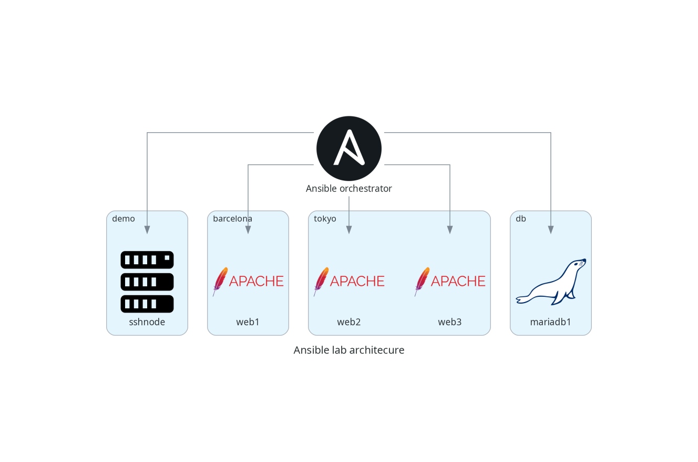

## Pre-requisites

The best option to run the docker compose is to be in a WSL2 environment or directly on a linux ssytem.
I couldn't test under MS Windows systems.

To install Docker Desktop on Windows:
- https://docs.docker.com/desktop/setup/install/windows-install/

To install WSL2 in Windows:
- https://learn.microsoft.com/en-us/windows/wsl/install

To integrate Docker Desktop with WSL2:
- https://docs.docker.com/desktop/features/wsl/

## Tested environments

- Linux Fedora 42: successful
- MS Windows 11 + Docker Desktop 4.41.2 (191736) + WSL2: successful

## Download the resources

```
git clone https://github.com/ebah80/lab_ansible.git
```

Downlaod MariaDB from here:
- https://archive.mariadb.org//mariadb-11.4.4/bintar-linux-systemd-x86_64/mariadb-11.4.4-linux-systemd-x86_64.tar.gz

and copy in /ansible/files/

## Build the environment

```
docker-compose up -d
```

## Infrastructure schema



## Login to the orchestrator

```
docker exec -it ansible-orchestrator sh
apk add --no-cache curl
```

## First run: PING > PONG

```
ansible all -i inventory/hosts.ini -m ping
```

## Facts

```
ansible sshnode -i inventory/hosts.ini -m setup
ansible sshnode -i inventory/hosts.ini -m setup -a "filter=ansible_distribution*"
```

## Play with the inventory

```
ansible -i inventory/hosts.ini all --list-hosts
ansible -i inventory/hosts.ini "barcelona:tokyo" --list-hosts
ansible -i inventory/hosts.ini "barcelona:&tokyo" --list-hosts
ansible -i inventory/hosts.ini --list "bar*" --list-hosts
ansible -i inventory/hosts.ini --list tokyo --list-hosts
```
- https://docs.ansible.com/ansible/latest/inventory_guide/intro_inventory.html

### Inventory: limit

```
ansible -i inventory/hosts.ini all -m ping --limit "demo"
```

### Inventory: list-hosts

```
ansible -i inventory/hosts.ini all -m ping --list-hosts
ansible -i inventory/hosts.ini all -m ping --limit "demo" --list-hosts
```

## ansible-playbook

### Install webserver

```
ansible-playbook 001_install_apache.yml -i inventory/hosts.ini --list-hosts
ansible-playbook 001_install_apache.yml -i inventory/hosts.ini --check
ansible-playbook 001_install_apache.yml -i inventory/hosts.ini
docker inspect -f '{{range .NetworkSettings.Networks}}{{.IPAddress}}{{end}}' web*
```

Open IPs in browser:
- http://container-ip/

or from the orchestrator run

```
sh ./scripts/curl.sh
```

### Change welcome page

```
ansible-playbook 002_welcome_page.yml -i inventory/hosts.ini
```

### Install and configure MariaDB

First of all download MariaDB tar.gz from here:
- https://archive.mariadb.org//mariadb-11.4.4/bintar-linux-systemd-x86_64/mariadb-11.4.4-linux-systemd-x86_64.tar.gz

and place it under:
- /ansible/files

```
ansible-playbook 003_install_configure_mariadb.yml -i inventory/hosts.ini
```

Log into mariadb container and start MariaDB:

```
docker exec -it mariadb1 /bin/bash
run_mariadbd-11.4.4 
```

## Troubleshooting

```
-v
-vv
-vvv
```

## ansible roles (ansible-galaxy)

https://galaxy.ansible.com/ui/repo/published/community/mysql/

### Prepare the orchestration node

```
ansible-galaxy collection list
ansible-galaxy collection install community.mysql
ls -l /usr/lib/python3.12/site-packages/ansible_collections/community/mysql/plugins/modules
```

### Create databases

```
ansible-playbook 004_mariadb_create_db.yml -i inventory/hosts.ini
```

### Create users

```
ansible-playbook 005_mariadb_create_users.yml -i inventory/hosts.ini
```

## Security: Ansible Vault

```
ansible-vault create db_passwords.yml
>> secretoiberico <<
```

```db_passwords.yml
vault_db_passwords:
  rick: "secret-rick"
```

```
cat db_passwords.yml
ansible-vault view db_passwords.yml
ansible-vault edit db_passwords.yml
```

```
ansible-playbook 006_mariadb_create_users_vault.yml -i inventory/hosts.ini --ask-vault-pass
```

```
docker exec -it mariadb1 /bin/bash
/opt/mariadb/mariadb-11.4.4/bin/mariadb -u rick -p -S /var/lib/mariadb-11.4.4/mariadb.sock
>> secret-rick <<
```

## Terminate the environment

```
docker-compose down -v
```
